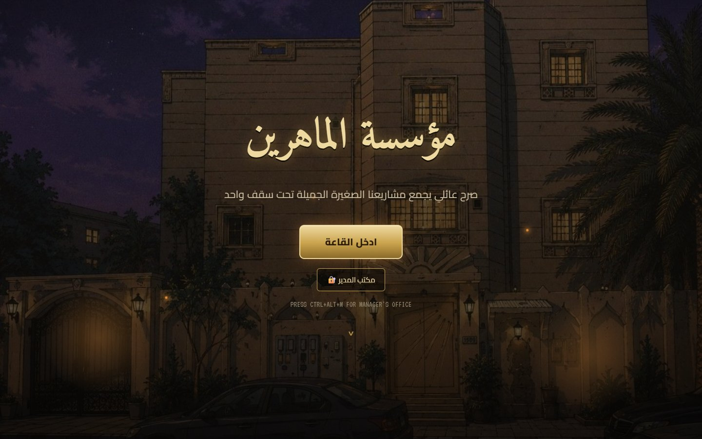
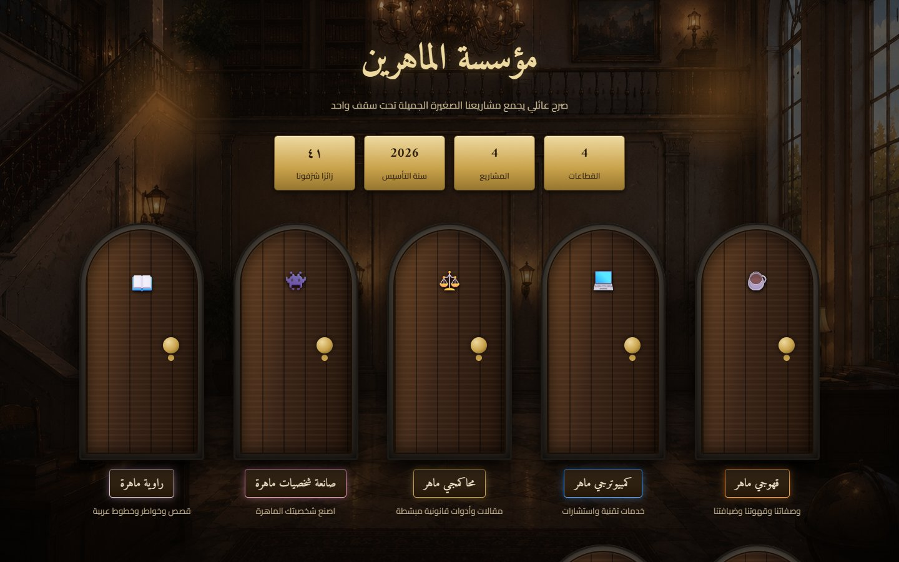
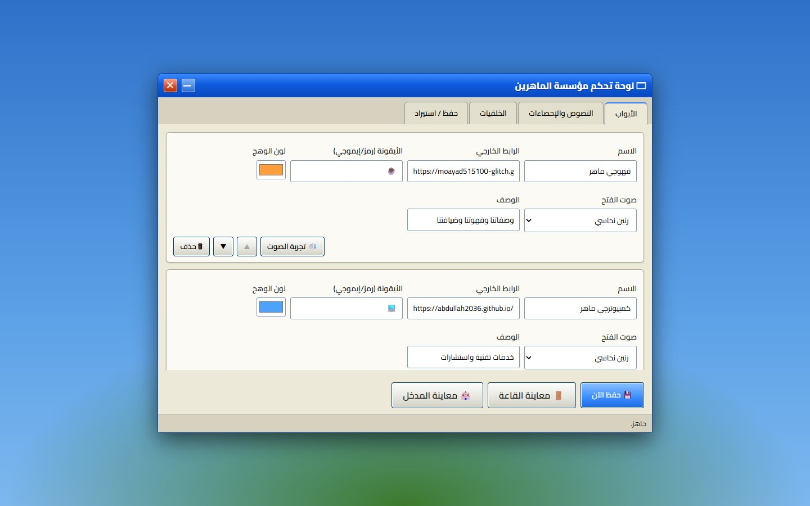

# مؤسسة الماهرين — Al-Maheren Foundation portal

A family "foundation" website that gathers the family's small projects under one roof: a coffee blog, a tech store, legal articles, a character creator, stories, an alphabet site for kids, and an acrylic-art shop. Visitors walk in through a gatehouse, enter a great hall, and **open a door for each project**.

Everything is editable from a hidden, Windows XP-style **manager's office**, which publishes changes straight to this repository.

**Live:** https://abdullah2036.github.io/maheren/



## Tour

| Page | What happens |
|---|---|
| **Entrance** (`index.html`) | A BIOS-style boot screen on the first visit, then a night-time façade with the foundation's name, news, "about" and a reception desk (WhatsApp). "Enter the hall" walks you in. |
| **The great hall** (`hall.html`) | Live stats (visitors, founding year, projects, sectors) above a row of wooden doors. Each door creaks open with a sound and shows the project inside a framed portal, or in a new tab. |
| **Manager's office** (`admin.html`) | Hidden behind `Ctrl + Alt + M` (or the small button) and a passcode. A retro CRT monitor boots into an XP-style control panel. |



## The control panel



Tabs for **Doors** (name, link, icon, glow colour, opening sound, order), **Texts & stats**, **Backgrounds** (colour or uploaded image for the entrance, hall and office) and **Save / Import**.

- Changes preview instantly in the browser (`localStorage`).
- **Publish** writes `config.json` to the repo through the GitHub Contents API, using a fine-grained token that stays in the manager's browser. GitHub Pages then serves the new version to everyone.
- Export / import the whole configuration as JSON.

Config is merged in layers: **built-in defaults ← `config.json` from the repo ← local edits in this browser**.

## Details

- Sounds (door creak, chimes, clicks) are **synthesised with the Web Audio API**, so there are no audio files.
- Visitor counter through a public counter API, with a local fallback if it's unreachable.
- Arabic, RTL, and responsive; honours `prefers-reduced-motion`.

## Run locally

```bash
git clone https://github.com/abdullah2036/maheren.git
cd maheren
python -m http.server 8000     # then open http://localhost:8000
```

A server is needed (rather than opening the file directly) because the site fetches `config.json`.

## Project structure

```
maheren/
├── index.html     entrance: title, news, about, reception, manager's-office prompt
├── hall.html      the great hall: stats and doors, portal overlay
├── admin.html     manager's office: CRT login screen and XP-style control panel
├── app.js         config store (defaults → config.json → localStorage), Web Audio SFX,
│                  visitor counter, entrance + hall logic, door portal
├── style.css      shared styles
└── config.json    published site configuration (edited by the control panel)
```

## Tech stack

HTML, CSS, vanilla JavaScript · Web Audio API · GitHub REST API (Contents) · GitHub Pages

---

Built by **Abdullah Bokhary** · [Portfolio](https://abdullah.pageui.workers.dev/) · [LinkedIn](https://www.linkedin.com/in/abdullah-bokhary-840315326/) · [GitHub](https://github.com/abdullah2036)
